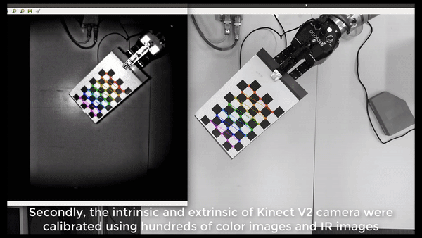
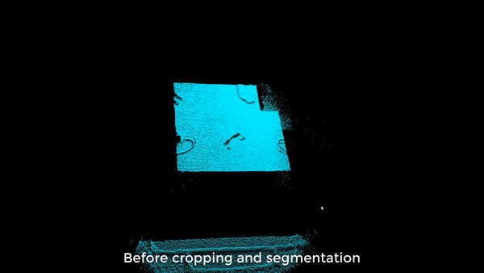
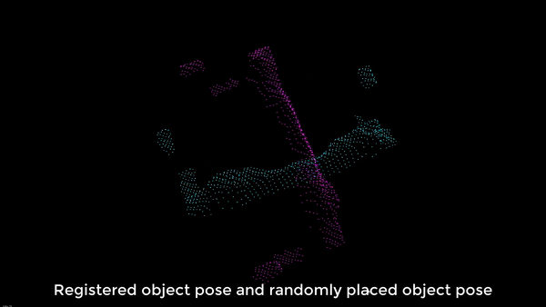

# Kuka_iiwa_3D_vision_pick_and_place
This repository is for using 3D camera and Kuka iiwa robot arm to pick and place object. You can use realsense camera or Kinect v2 camera.


Demo Video 1: [Link](https://youtu.be/M7GtTTIV9rA) 


Kinect V2 camera intrinsic before and after calibration:




Eye to hand calibration:


Before and after segmenting point cloud:




Point cloud matching using ICP:




Final grasping demo:


# for installing the kinect camera ros driver
https://github.com/code-iai/iai_kinect2

# installing [easy hand eye](https://github.com/IFL-CAMP/easy_handeye)

# necessary library:
```
sudo apt-get install ros-kinetic-controller-interface
sudo apt-get install ros-kinetic-controller-manager
sudo apt-get install ros-kinetic-joint-limits-interface
sudo apt-get install ros-kinetic-socketcan-interface
sudo apt-get install ros-kinetic-moveit-core
sudo apt-get install ros-kinetic-moveit-ros-planning
sudo apt-get install ros-kinetic-moveit-ros-planning-interface
sudo apt-get install ros-kinetic-ros-control ros-kinetic-ros-controllers
sudo apt-get install ros-kinetic-moveit
```

### for kinect v2 camera, you need intrinsic calibration, the images data for calibration is under kinect_cal_data
useful link: https://github.com/code-iai/iai_kinect2/tree/master/kinect2_calibration#calibrating-the-kinect-one


### To calibrate the relative position between kuka iiwa and kinect v2 camera
```
roslaunch my_pcl_tutorial calibrate_iiwa_kinect.launch
```
### To calibrate the relative position between kuka iiwa and realsense camera
```
roslaunch my_pcl_tutorial calibrate_iiwa_realsense
```

### To view the aruco marker result
```
rosrun rqt_image_view rqt_image_view
```

### To initialize the original workpiece template and the original grasping point of kuka iiwa
```
roslaunch my_pcl_tutorial initialize_object_template_iiwa_pose_kinetic.launch 
```

### By using the following command to save the workpiece_template_0.pcd as workpiece_template.pcd under directory ~/.ros
```
cp workpiece_template_0.pcd workpiece_template.pcd
```
### manually control kuka iiwa to the unload position and save its pose as pose_unload.txt under directory ~/.ros
```
cp pose.txt pose_unload.txt
```
### manually control kuka iiwa to the grasping position and save its pose as pose.txt under directory ~/.ros

### Use the following command to control kuka iiwa to grasp the randomly placed workpiece
```
roslaunch my_pcl_tutorial test_five_iiwa_test_transform_grasp.launch 
```
